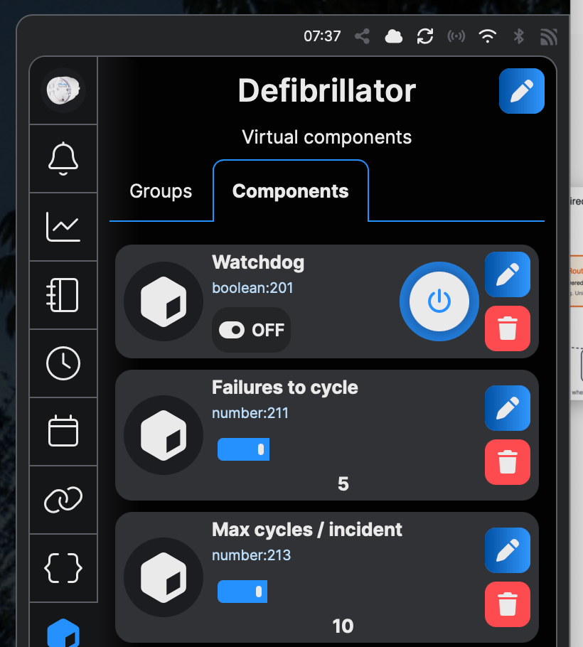

# Shelly Defibrillator

A self-contained watchdog for the Shelly Plug S Gen3 that power-cycles a frozen router — and **only** when the router itself is actually dead, not when the internet merely goes down.

This project uses a Shelly Plug S Gen3 to monitor a local router/firewall (or any device that answers a network connection) and perform a controlled power cycle only when the tracked device itself stops responding.

It was built for a real-world problem: my home automation server and router occasionally freeze and have to be power-cycled manually. A normal "internet is down" automation would be too aggressive, because an ISP outage does not mean the router itself is dead. And a home automation server that is down can't restart itself.

The whole point of this script is the distinction most automations get wrong: **it checks whether the device it powers actually responds locally**, rather than whether the internet is reachable.

## What it does

The Shelly Plug S Gen3 powers the device — let's say it's our internet router. A script running locally on the Shelly periodically sends an HTTP request to the router's local management IP.

- If the router returns **any** HTTP response, it is considered alive.
- If the router does **not** respond after a configurable number of consecutive failures, the plug cycles the power, then waits for the router to boot before testing again.
- If the router still does not respond, the script retries with an increasing (backoff) wait interval, up to a configurable ceiling of cycles per incident.

Everything runs as a small state machine on the plug itself. State is persisted in KVS, so even a power loss or firmware restart mid-incident resumes safely.

## Design goals

- **Local-first:** runs directly on the Shelly device.
- **No external dependencies:** no Home Assistant, IFTTT, DNS, internet, or cloud — not even [Shelly Control Cloud](https://control.shelly.cloud).
- **Detects router failure, not internet failure.**
- **Conservative recovery logic** with exponential backoff and a hard cap on cycles per incident.
- **Maintenance mode** via a virtual switch.
- **Persistent state** using Shelly KVS, with safe resume after reboot.
- **Minimal footprint** — fits within Shelly scripting memory limits (no arrow functions, no template literals; written for the mJS engine).

## Why HTTP and not ping?

Shelly scripting on this device does not provide a simple ICMP ping primitive, so HTTP is used as a practical local liveness check.

For this use case the exact HTTP status code does not matter. A `401`, `403`, `404`, a redirect, or a login page all prove that the router's TCP/IP stack and web service are alive enough to avoid a hard power cycle. A timeout or a connection failure means the router did not respond locally.

> **Pick a lightweight target path.** The Shelly HTTP client has a limit on the response body it will accept. If you point `target_url` at a large management page (a single-page app dashboard, for example), a *healthy* router can return a body big enough to produce a client-side error — which the watchdog would read as "down" and cycle a perfectly good router. You don't need the real page; you only need proof the stack answers. Point `target_url` at something small — a deliberately non-existent short path such as `http://192.168.1.1/x` returns a tiny `404`, which still counts as alive. If you want to verify your device's behaviour, temporarily log the probe's error code (see `probe()` in the script) and confirm a healthy router never returns an error.

> **Note on HTTPS:** the probe sets `ssl_ca: "*"`, which accepts any certificate. That is intentional and fine for a LAN liveness check (it is not authenticating anything), but be aware certificate validation is disabled for the probe.

## Hardware

- Shelly Plug S Gen3 (may work on older plugs/switches, but untested).
- The router/firewall powered through the Shelly Plug.
- **Strongly recommended:** a separate access point so the plug keeps Wi-Fi even while the router is power-cycled. If your only access point *is* the router being cycled, the plug loses its own network during the cycle. See Security considerations below.

Tested with:

- A local router with its management interface at `http://192.168.1.1/`
- A UniFi Dream Router answering on `https://192.168.1.1/` (point `target_url` at a small path as noted above)

## Installation

1. Open the Shelly Plug's local web UI (or the Shelly app) and go to **Settings → Scripts**.
2. Create a new script, paste in [`router-defibrillator.js`](router-defibrillator.js), and **Save**.
3. **Start** the script and enable **Run on startup**.
4. On first run the script automatically creates three virtual components (Watchdog, Failures to cycle, Max cycles / incident) and a default `defib_config` entry in KVS.
5. Edit `defib_config` with your own values (see Configuration). The easiest way from a computer on the same LAN is the local RPC endpoint:

   ```bash
   curl -X POST http://<PLUG_IP>/rpc/KVS.Set \
     -H "Content-Type: application/json" \
     -d '{"key":"defib_config","value":"{\"target_url\":\"http://192.168.1.1/x\",\"power_off_s\":10,\"initial_retry_s\":300,\"max_retry_s\":86400,\"poll_s\":60,\"timeout_s\":5,\"switch_id\":0}"}'
   ```

   (The KVS value is a *string* containing JSON, hence the escaped quotes.)
6. **Restart the script** so it reloads the new config, then plug your router into the Shelly Plug.

## Configuration

Two groups of settings. The three you tune most often are exposed as **virtual components** so you can change them from the Shelly UI/app without editing the script. The install-time parameters live in **KVS**.

### Virtual components (UI-tunable)

| Component | Default | Purpose |
|---|---|---|
| Watchdog | on | Enables/disables the watchdog. Turning it **off** restores power and acts as maintenance mode. |
| Failures to cycle | 3 | Consecutive failed probes before a power cycle (1–20). |
| Max cycles / incident | 5 | Maximum power cycles per incident before giving up. `0` means retry forever (0–50). |

The script creates these three components automatically on first run:



### KVS parameters (key: `defib_config`)

| Key | Default | Meaning |
|---|---|---|
| `target_url` | `http://192.168.1.1/` | Local URL probed for liveness. Use a small path (see Why HTTP). |
| `power_off_s` | `10` | Seconds the power stays off during a cycle. |
| `initial_retry_s` | `300` | Seconds to wait for the device to boot before the first re-probe. |
| `max_retry_s` | `86400` | Upper bound for the backoff wait (default 24 h). |
| `poll_s` | `60` | Seconds between liveness checks while monitoring. |
| `timeout_s` | `5` | Per-probe HTTP timeout. Keep this well below `poll_s`. |
| `switch_id` | `0` | The relay/switch ID the plug controls. |

Example `defib_config` (also in [`examples/`](examples/)):

```json
{
  "target_url": "http://192.168.1.1/x",
  "power_off_s": 10,
  "initial_retry_s": 300,
  "max_retry_s": 86400,
  "poll_s": 60,
  "timeout_s": 5,
  "switch_id": 0
}
```

Internal runtime state is persisted separately under the KVS key `defib_state` — you don't need to touch it.

## How to test it

You can verify the full cycle without actually freezing your router:

1. Set `target_url` to an address that won't answer — e.g. an unused IP on your LAN such as `http://192.168.1.250/`.
2. Restart the script and watch the log. You should see consecutive `fail N/threshold` messages, then a `cycle` once the threshold is hit, followed by the backoff waits.
3. Set `target_url` back to your real device and restart. The next probe should log `recovered` and the watchdog returns to monitoring.

To exercise maintenance mode, toggle **Watchdog** off: the plug restores power and stops monitoring until you turn it back on.

## States and recovery

- **MON** — normal monitoring; probes every `poll_s`.
- **CYC** — powering off, then back on.
- **WAIT** — letting the device boot, then probing.
- **LOCK** — gave up after `Max cycles / incident`; power is left **on** and monitoring stops.
- **DISABLED** — maintenance mode (Watchdog = off).

**Exiting LOCK:** if the watchdog hits its cycle ceiling it parks in LOCK to avoid hammering a device that clearly isn't coming back. To resume, toggle **Watchdog** off and then on — this resets the incident counters and returns to MON.

## Security considerations

Jamming your Wi-Fi, or knocking the plug off the network directly, makes the plug lose its connection and can trigger a power cycle even though the router is alive. Someone who knows your setup could abuse this as a denial-of-service vector.

**Mitigation:** use a wired device (e.g. a Shelly 1 Pro on Ethernet) instead of relying on Wi-Fi for the watchdog.

## Important safety note

Do not use this for equipment where sudden power loss can cause damage, data loss, or unsafe conditions. It is intended for home/small-office network equipment that can tolerate a controlled power cycle.

## License

MIT — see [LICENSE](LICENSE).
